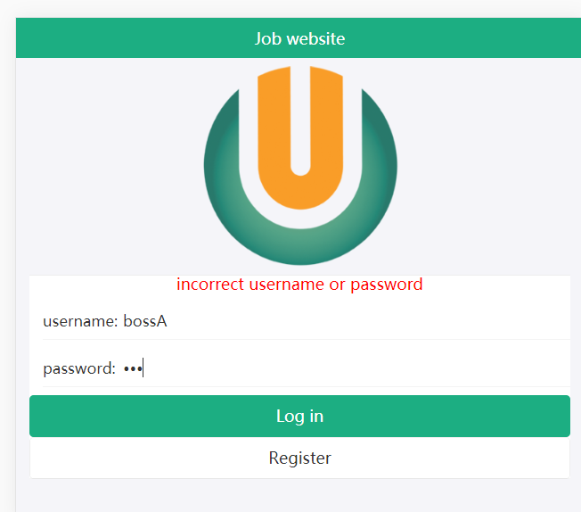
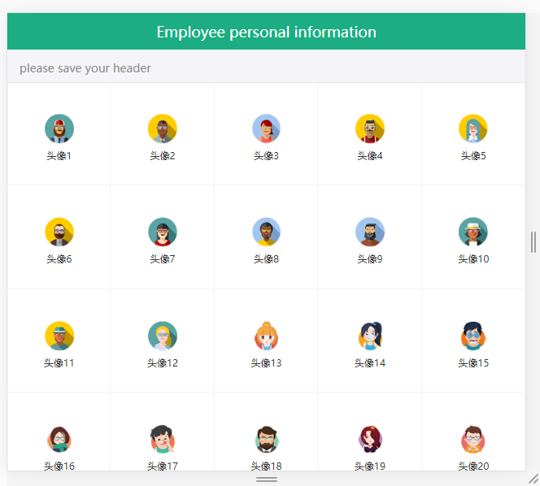
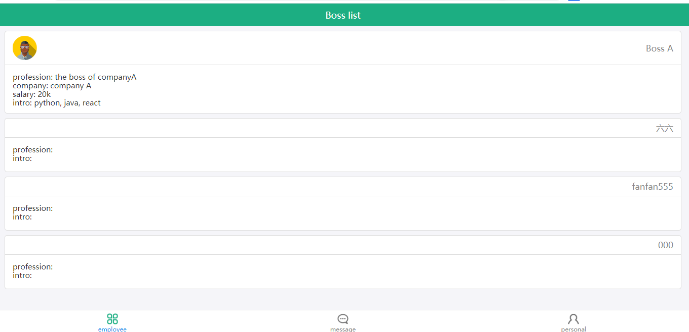
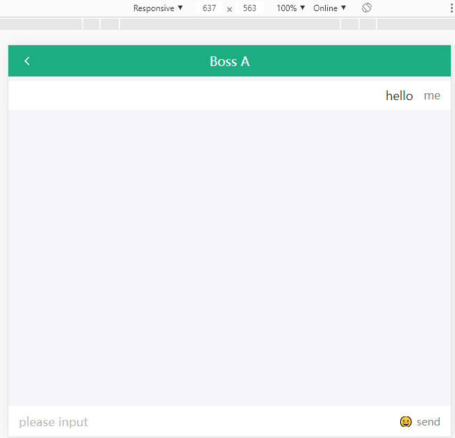
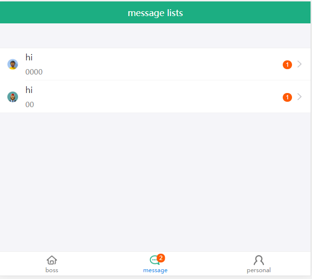
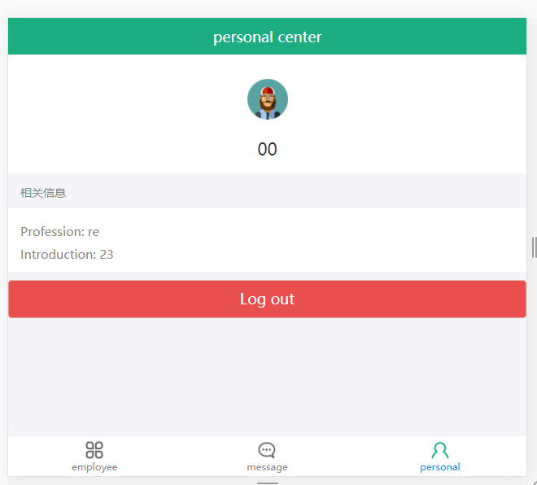

This if the front-end devleloped by react app project, the back-end has been depoloyed on heroku
## Develop

In the project directory, if npm start doesn't work, you can run:

### `npm install -g`
### `npm rm node_modules`
### `npm install`

Runs the app in the development mode. 
Open [http://localhost:3000](http://localhost:3000) to view it in the browser.

The page will reload if you make edits. 
You will also see any lint errors in the console.

## Content
###log in page

### register page

### main page

### chat page

### message page

### log out page

